  

  

  

    
    
  

---

 **STUFF I'M HACKING ON**

- 🏫 **Campus Life:** Pejuang gelar di **Universitas Pamulang** 
- 🌱 **Skill Path:** Lagi dalam misi naklukin **Laravel**, **Linux**, dan ilmu **Cyber Security**.
- 👨‍💻 **Current Project:** [**Laravel Project App**](https://github.com/saikaizu/project-app) — *Cooking something spicy!* 🛠️
- 💬 **Nanya-nanya:** Gas lah tanya soal Windows, PHP, Web, atau Linux. Gw suka ngobrolin **Data Structures** & **Network Security** sambil ngopi.
- ⚡ **Developer Mantra:** *Still learning, Must working, Keep growing, and Always praying.* 🙏

---

 **MY DEV ARSENAL**

  

---

 **CODE METRICS & VIBES**

  
  
    
  
  

---
---

 **CODE METRICS & VIBES**

  
  
  
  
    

  

    

  

---

---

 **CONNECT WITH ME**

  
  

   
  <a href="https://www.youtube.com/watch?v=t_orDzVFWXY" target="_blank">
    
     
    <b>🍿 Nonton Kuy: MERGE SORT | APA BENAR SESIMPEL ITU?!</b>
  </a>

 

  

